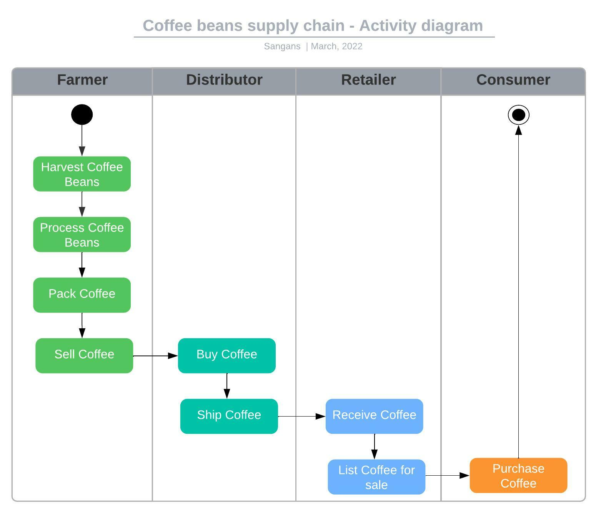
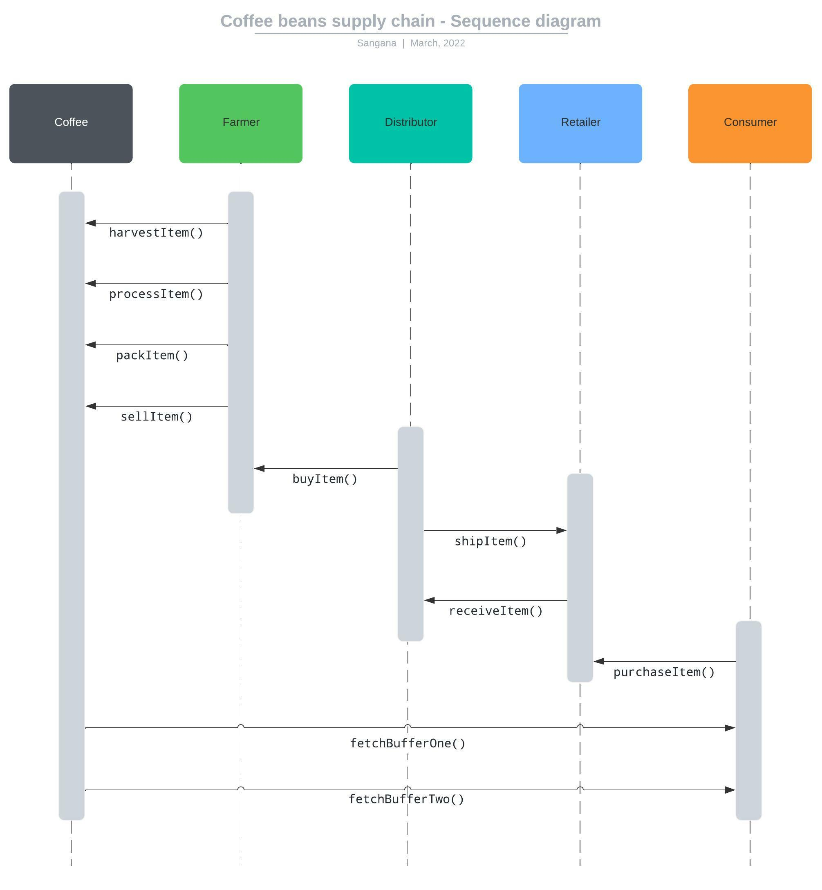
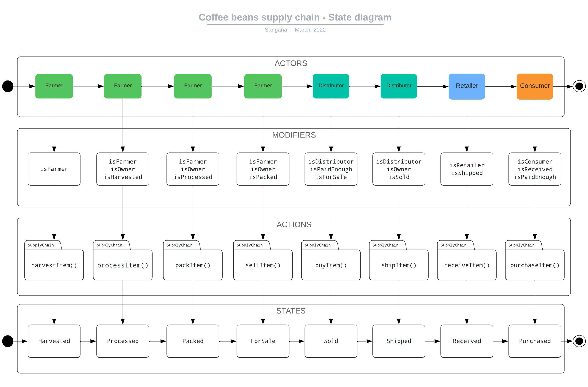
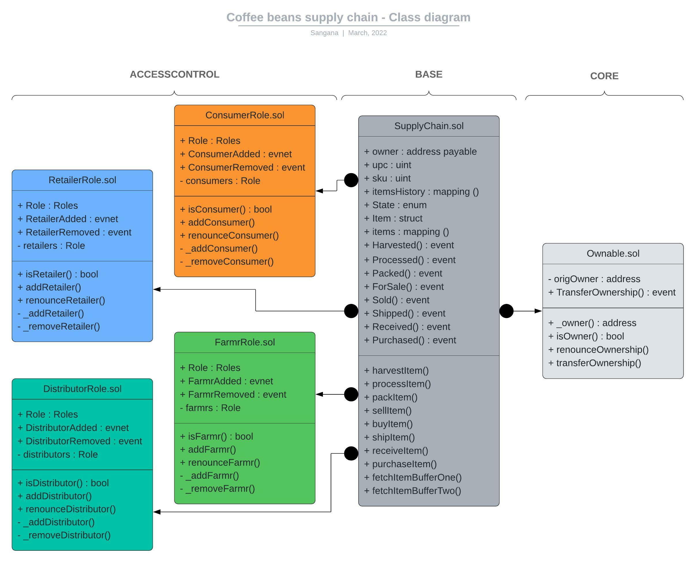

# Supply chain & data auditing

This repository containts an Ethereum DApp that demonstrates a Supply Chain flow all the way from farmer to a Buyer. The user story is similar to any commonly used supply chain process. A Seller can add items to the inventory system stored in the blockchain. A Buyer can purchase such items from the inventory system. Additionally a Seller can mark an item as Shipped, and similarly a Buyer can mark an item as Received.

## Project writeup UML
### Activity Diagram


### Sequence Diagram


### State Diagram


### Class Diagram


## Project write-up - Libraries
I have used the library called "Roles" to manage access of roles to provided accounts.
This library checks, assigns and removes different roles to provided addresses.

## General Write Up and Deployment
I have deployed this contract on the Ropsten test network as I could not get any test ether from Rinkeby faucet.

### Ropsten test network deployment details below
Transaction hash : 0x63e16683a9470b96f604348819d1daf920230e5c3f86b9652a4c70489b5f8d90\
Contract address : [0x44b948bA5F48099848700b1373A06f7680f9c3F9](https://ropsten.etherscan.io/tx/0x63e16683a9470b96f604348819d1daf920230e5c3f86b9652a4c70489b5f8d90#eventlog)\
Program version numbers : 1.0.0\
Node version number : v10.19.0\
Truffle version number : v5.5.2\
npm version : 6.14.4\
web3 version number : 1.7.0\

## Roles and actions
Farmer: harvest, process, pack and sell coffee to distributor.\
Distributor: buys coffee from farmer and ships to the retailer.\
Retailer: receives the coffee and lists for sale so end consumers can purchase.\
Consumer: purchase coffee!.

## Installing and running
Clone this repository:

```
git clone https://github.com/udacity/nd1309/tree/master/course-5/project-6
```

Change directory to ```project-6``` folder and install all requisite npm packages:

```
cd project-6
npm install
npm audit fix
```

Launch Ganache or Ganache GUI:

```
ganache-cli -m <your mnemonic> 
```

In a separate terminal window, Compile smart contracts:

```
truffle console
compile
```

Migrate the smart contracts
```
migrate --reset

```

Test the smart contracts
```
test
```

All 11 tests should pass as below.
### Test notes and output
There are a total of 10 tests, and 1 initialization test which adds roles farmer, distributor, retailer and consumer.
Each test is dependent on the previous test as the previous test sets the state correctly for the next test to pass.
All tests have been tested locally and product successful results. See test output below.

```
truffle(development)> test
Using network 'development'.


Compiling your contracts...
===========================
> Everything is up to date, there is nothing to compile.
ganache accounts used here...
Contract Owner: accounts[0]  0xfa0395fcAD077B11967ADC6e1257f382791F2709
Farmer: accounts[1]  0x3fDAcAD1347ed320d235C42C8c9E1D5c99f2e761
Distributor: accounts[2]  0xc13042bB30F5636d1f694282983366366431859F
Retailer: accounts[3]  0x700c62ED6D2Db647C80AaaEcc7b50c38a2d017F8
Consumer: accounts[4]  0x06bE75f134dD2325D21EccDaA28cce62e9742794


  Contract: SupplyChain
    ✓ Test the contract can assign roles to the accounts (588ms)
    ✓ Testing smart contract function harvestItem() that allows a farmer to harvest coffee (335ms)
    ✓ Testing smart contract function processItem() that allows a farmer to process coffee (130ms)
    ✓ Testing smart contract function packItem() that allows a farmer to pack coffee (215ms)
    ✓ Testing smart contract function sellItem() that allows a farmer to sell coffee (118ms)
    ✓ Testing smart contract function buyItem() that allows a distributor to buy coffee (223ms)
    ✓ Testing smart contract function shipItem() that allows a distributor to ship coffee (118ms)
    ✓ Testing smart contract function receiveItem() that allows a retailer to mark coffee received (190ms)
    ✓ Testing smart contract function purchaseItem() that allows a consumer to purchase coffee (205ms)
    ✓ Testing smart contract function fetchItemBufferOne() that allows anyone to fetch item details from blockchain (48ms)
    ✓ Testing smart contract function fetchItemBufferTwo() that allows anyone to fetch item details from blockchain (45ms)


  11 passing (2s)

truffle(development)>
```
